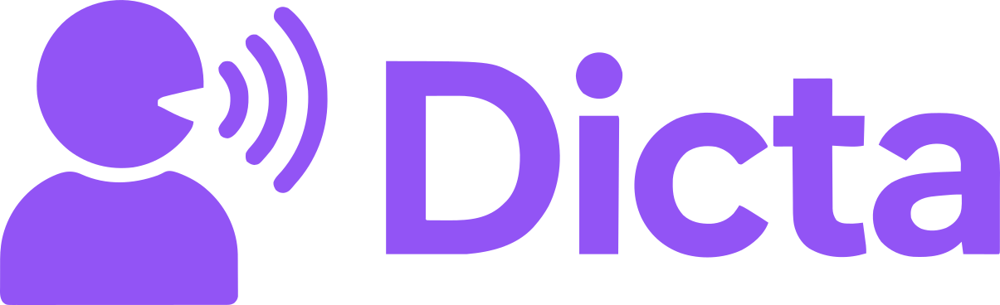

<div align="center">
  
  <h1>🎙️ Dicta</h1>
  <p><b>Acessibilidade e Inclusão na Resolução de Questionários Educacionais</b></p>
</div>

---

## 💡 Sobre o Projeto

O **Dicta** é uma plataforma educacional inovadora desenvolvida para democratizar o acesso a provas e atividades. Focada 100% em acessibilidade, a aplicação permite que estudantes com deficiência visual, motora ou dificuldades de leitura respondam a questionários inteiros utilizando apenas **comandos de voz**.


## 🚀 Tecnologias Utilizadas

Este projeto foi construído utilizando as seguintes tecnologias:

*   **[React](https://reactjs.org/)** - Biblioteca JavaScript para construção da interface.
*   **CSS3** - Estilização customizada e responsiva.
*   **Web Speech API** - Para reconhecimento e síntese de voz nativos do navegador.

## 🛠️ Como Executar o Projeto

Siga os passos abaixo para rodar o Dicta na sua máquina local:

1. Clone este repositório:
   
```bash
git clone https://github.com/M-rcos/frontend-p3-teste
cd dicta
npm install
npm run dev
```
